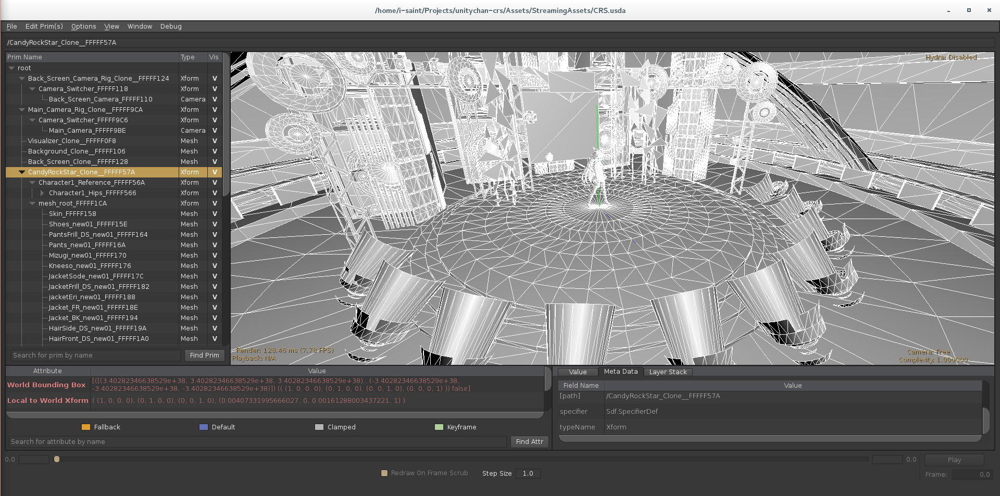
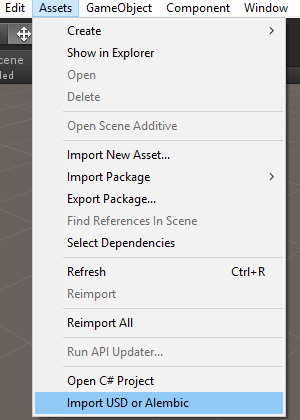
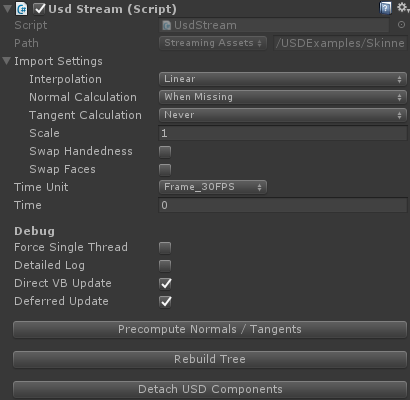

# USD For Unity

### Overview
[USD (Universal Scene Description)](http://graphics.pixar.com/usd/) is a file format that can store time-sampled 3D scene. It is something like 'Better Alembic' developed by Disney / Pixar.  
This plugin allow you to import **USD or Alembic** scene to Unity and export Unity scene to USD or Alembic file. The above image is exported scene of [Candy Rock Star](https://github.com/unity3d-jp/unitychan-crs) in usdview.

### Usage
Supported platform is Windows (64 bit) and Linux.  
There is a package for Windows: [USDForUnity.unitypackage](Packages/USDForUnity.unitypackage)  
(Notice: [VC2015 runtime](https://www.microsoft.com/en-us/download/details.aspx?id=48145) must be installed, which is usually installed on recent version of Windows).  
Assets -> Import USD or Alembic menu will appear after importing package.

  

Some of USD's features are supported, some of others are not.
- Xform, Camera and Mesh schemas are supported. Mesh topology can be dynamic.
- Animation can be interpolated, which was not supported by [AlembicImporter](https://github.com/unity3d-jp/AlembicImporter).
- Normals and tangents can be generated on the fly. But generating tangent is extremely slow and not recommended to do it at every frame.
- Variant sets can be switched via inspector.
- References & instances are supported.
- All the payloads will be loaded on the scene is loaded.
- Subdivision is **not** supported. It is planned but unlikely to come soon.
- NURBS is **not** supported.
- Point instancer is **not** supported.

### Notes
- This plugin is designed to stream data directory from USD (or Alembic) files because storing all vertex cache data in memory is sometimes impractical. For this reason, USD files must be in [StreamingAssets](https://docs.unity3d.com/Manual/StreamingAssets.html) directory at runtime.
We are planning to add converter instead of direct USD file streaming for better performance and runtime portability (just like built-in FBX importer is doing).

- This plugin doesn't care about materials as USD itself doesn't support material schema.
I heard USD will support material schema that can store basic PBR parameters. When it is done, this plugin will adapt to it.
Apart from that, we are planning to add [NVIDIA's MDL](http://www.nvidia.com/object/material-definition-language.html) support as we have clients who are using it.

- This plugin supports import & export skinning animation (bone + vertex weight). But these data are stored in custom attributes and unlikely to compatible with other tools for now. I heard USD's mesh schema will support bone + weight attributes. When it is done, this plugin will adapt to it.

- You can build this plugin from source by just open Plugin/usdi.sln with VisualStudio2015 and build it. Pre-built USD is included in this repository (It is based on [our fork](https://github.com/unity3d-jp/USD/tree/i-saint_experiments) that includes some bug fixes and optimizations for Windows).  
There is cmake build file (Plugin/CMakeLists.txt) for non-Windows build. In this case you must build USD by yourself, but building plugin is straightforward as required packages are almost same as USD. I confirmed it works on Ubuntu 16 (Unity for Linux is [here](https://forum.unity3d.com/threads/unity-on-linux-release-notes-and-known-issues.350256/)).

## License
[MIT](USDForUnity/Assets/StreamingAssets/UTJ/USDForUnity/License.txt)
